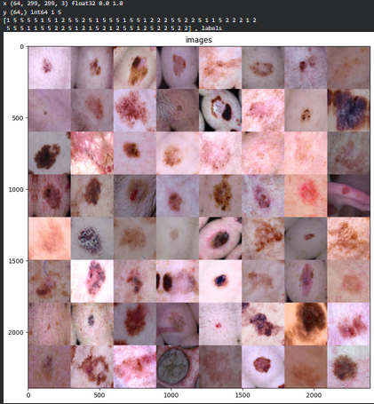
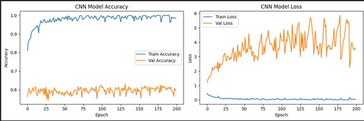
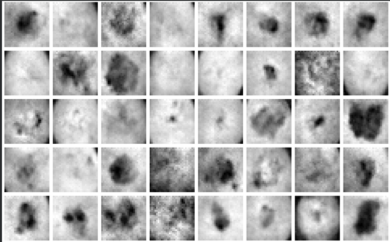
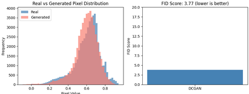

# MedGen 

A deep learning project combining a CNN classifier and a DCGAN to classify and synthesize skin lesion images. Built on the HAM10000 dermatoscopy dataset, MedGen explores how generative models can create realistic synthetic medical images — a step towards solving the data scarcity problem in healthcare AI.

>  **Disclaimer:** This is a research/learning project. The models are not clinically validated and should not be used for real medical diagnosis.

---

## What Problem Does It Solve?

Skin cancer detection relies on large labelled image datasets — which are expensive, privacy-sensitive, and hard to collect. MedGen tackles this by:
- Training a CNN to classify lesions into 3 categories (Melanoma, Benign Keratosis, Basal Cell Carcinoma)
- Training a DCGAN to generate synthetic skin lesion images that could supplement real training data in the future

---

## Dataset

Trained on the [HAM10000 dataset](https://www.kaggle.com/datasets/uciml/pima-indians-diabetes-database) — 10,015 dermatoscopic images across 7 lesion types. We focused on 3 clinically significant categories to keep the classification meaningful and balanced.

---

## Visualizing the Data

Before training, we explored the dataset visually — each image is a dermatoscopic photo of a skin lesion, augmented during training with random rotations, flips, zoom, and brightness changes to improve generalization.

---

## CNN — Lesion Classification

A custom CNN was trained to classify lesions into 3 categories. The training curve below shows the model reaching ~99% training accuracy but ~61% validation accuracy — a clear case of overfitting due to the small dataset size and simple architecture. This highlights exactly why synthetic data generation matters.

---

## DCGAN — Synthetic Image Generation

A Deep Convolutional GAN was trained for 2000 epochs. The generator learns to produce realistic skin lesion images from random noise. The discriminator learns to distinguish real from fake. Over time the generator gets good enough to fool the discriminator.

---

## Evaluating the GAN — FID Score

To measure how realistic the generated images are, we computed the FID (Fréchet Inception Distance) score. Lower is better. A score of **3.77** indicates the generated image distribution closely matches the real one — strong performance for a basic DCGAN on small grayscale images.

---

## Tech Stack

Python · TensorFlow · Keras · Scikit-learn · NumPy · Pandas · Matplotlib · Seaborn · scikit-image

---

## How to Run
its  a .py file you can convert it into ipynb file and run it in cells in collab or in your own pc 
